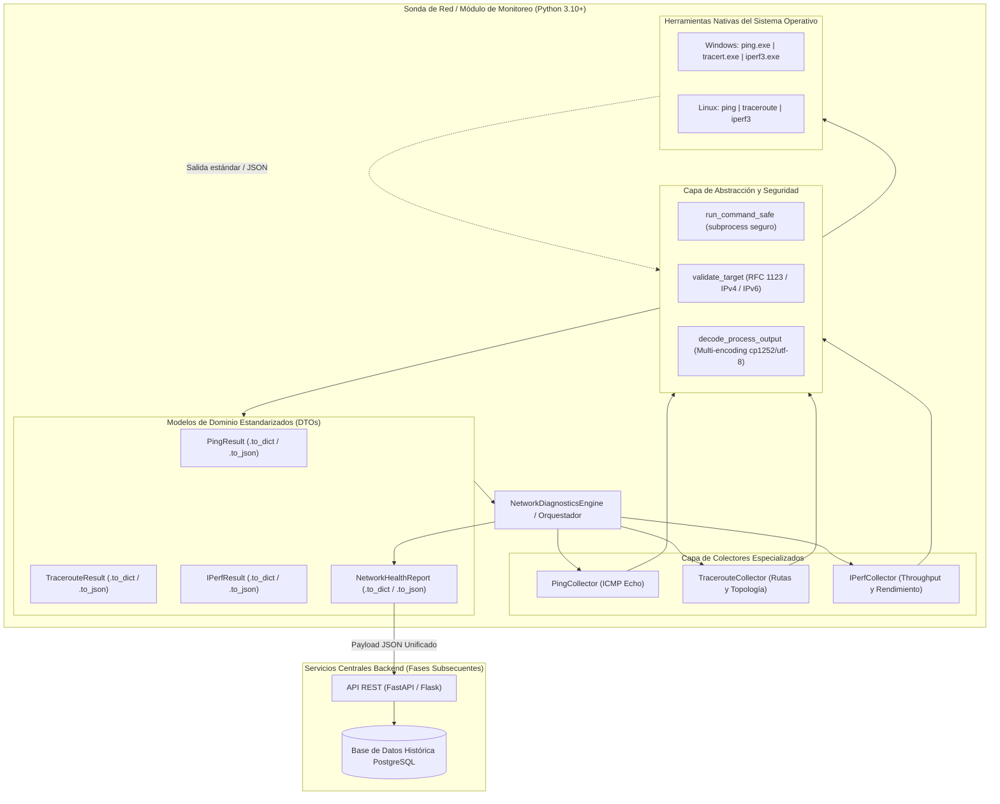
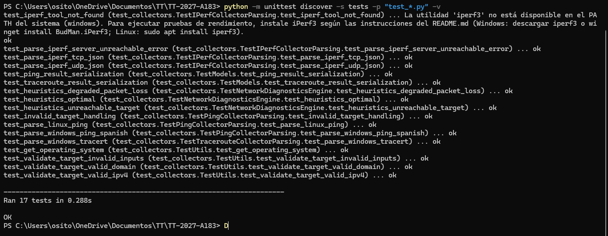
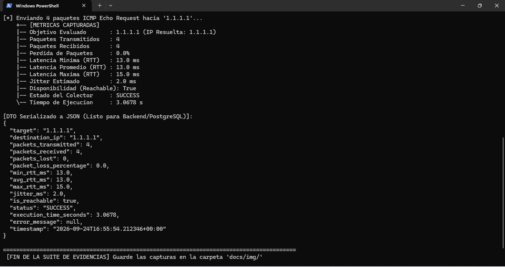
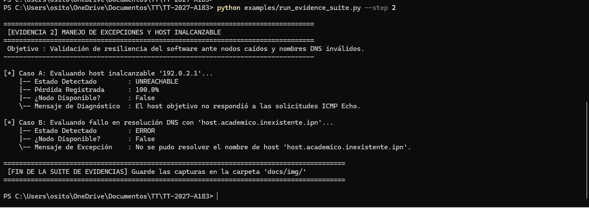
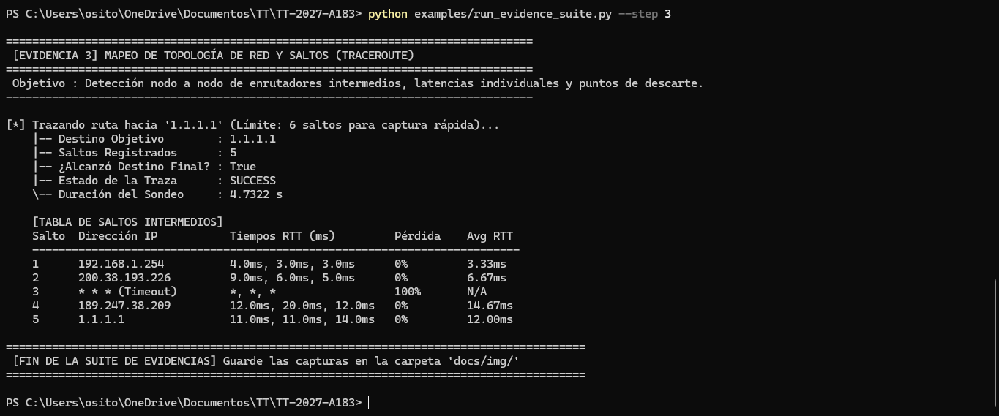

<div align="center">

# Instituto Politécnico Nacional
### Escuela Superior de Cómputo

---

# Sistema de Monitoreo, Diagnóstico y Recomendación de Acciones Iniciales para la Evaluación de Calidad de Redes de Área Local en Entornos Académicos

**Trabajo Terminal No. 2027-A183**

[](https://www.python.org/)
[]()
[]()
[](https://www.escom.ipn.mx/)

**Desarrolladores:**
- **Aragón Martínez Manuel Alejandro** (`maragonm1900@alumno.ipn.mx`) — *Módulo de pruebas de conectividad*
- **Bejarano Balmori David** — *Módulo de pruebas de rendimiento*

**Director del Trabajo Terminal:**
- **M. en C. Alcaraz Torres Juan Jesús**

---
</div>

## 📌 1. Descripción del Proyecto y Justificación (TT No. 2027-A183)

En instituciones educativas como la Escuela Superior de Cómputo (ESCOM - IPN), las redes de área local (LAN) e inalámbricas (WLAN) son infraestructuras críticas que sustentan laboratorios de cómputo, plataformas de evaluación y servicios académicos. No obstante, los problemas de degradación de servicio (alta latencia, intermitencias y pérdida de paquetes) suelen reportarse de manera genérica ("el internet está lento"), dificultando el diagnóstico oportuno y sobrecargando al personal técnico.

El **Trabajo Terminal No. 2027-A183** aborda esta problemática mediante una arquitectura integral cliente-servidor que automatiza:
1. **Medición Objetiva de Calidad de Servicio (QoS):** Evaluación continua de latencia, jitter, disponibilidad de nodos, pérdida de paquetes y ancho de banda/throughput.
2. **Estructuración y Estandarización de Datos:** Transformación de salidas de herramientas del sistema operativo a objetos de dominio estructurados (DTOs) listos para serialización JSON y almacenamiento relacional.
3. **Persistencia Histórica:** Almacenamiento centralizado en PostgreSQL para análisis de tendencias temporales.
4. **Motor de Diagnóstico y Recomendación Inicial:** Generación automatizada de hipótesis de falla y sugerencias de acciones correctivas inmediatas (verificación de enlace físico, gateway, DNS o mitigación de congestión) antes de escalar a soporte especializado.
5. **Panel de Visualización Web:** Interfaz gráfica orientada a usuarios y administradores técnicos de red.

---

## 🏗️ 2. Arquitectura del Módulo de Monitoreo

El **Módulo de Monitoreo** (`src/monitoring/`) constituye la capa de telemetría y adquisición del sistema. Se encuentra completamente desarrollado bajo principios de diseño de software robusto: desacoplamiento modular, ejecución segura de procesos del sistema operativo (`shell=False`), tolerancia a fallos y compatibilidad multiplataforma nativa (Windows y Linux).



---

## 🎯 3. Mapeo de Componentes Desarrollados vs. Objetivos del Trabajo Terminal

| Componente Implementado | Archivo de Código | Justificación Técnica | Objetivo del TT que Cumple |
| :--- | :--- | :--- | :--- |
| **Modelos de Datos Estandarizados** | [`src/monitoring/models.py`](file:///c:/Users/osito/OneDrive/Documentos/Trabajo%20Terminal/src/monitoring/models.py) | Define DTOs tipados (`PingResult`, `TracerouteHop`, `TracerouteResult`, `IPerfResult`, `NetworkHealthReport`) con métodos nativos `.to_dict()` y `.to_json()` para persistencia. | **Objetivo Específico 1 y 2:** Normalización y estructuración previa al almacenamiento en PostgreSQL. |
| **Colector ICMP Ping** | [`src/monitoring/ping_collector.py`](file:///c:/Users/osito/OneDrive/Documentos/Trabajo%20Terminal/src/monitoring/ping_collector.py) | Mide latencia mínima, media, máxima, jitter y porcentaje de pérdida. Soporta Windows (ES/EN) y Linux mediante expresiones regulares resilientes. | **Cronograma Aragón:** "Desarrollo del módulo de pruebas de conectividad". |
| **Colector de Topología Traceroute** | [`src/monitoring/traceroute_collector.py`](file:///c:/Users/osito/OneDrive/Documentos/Trabajo%20Terminal/src/monitoring/traceroute_collector.py) | Traza la ruta salto a salto con detección de latencias individuales, pérdida por salto y puntos de falla. Incluye flag `-d` / `-n` para acelerar sondeos en LAN. | **Objetivo Específico 1:** Detección de nodos intermedios y disponibilidad en la infraestructura de campus. |
| **Colector de Rendimiento iPerf3** | [`src/monitoring/iperf_collector.py`](file:///c:/Users/osito/OneDrive/Documentos/Trabajo%20Terminal/src/monitoring/iperf_collector.py) | Evalúa throughput en Mbps, retransmisiones TCP (congestión de buffers) y jitter/pérdida UDP invocando iperf3 con salida nativa `-J`. Maneja ausencia de herramienta y servidores caídos. | **Cronograma Bejarano:** "Desarrollo del módulo de pruebas de rendimiento". |
| **Motor de Diagnóstico y Recomendaciones** | [`src/monitoring/diagnostics.py`](file:///c:/Users/osito/OneDrive/Documentos/Trabajo%20Terminal/src/monitoring/diagnostics.py) | Aplica heurísticas de red para clasificar la salud (`OPTIMAL`, `DEGRADED`, `UNREACHABLE`) y formular acciones iniciales al usuario. | **Objetivo Específico 3 y 4:** Identificar condiciones anómalas y emitir recomendaciones de solución inicial. |
| **Capa de Abstracción y Seguridad** | [`src/monitoring/utils.py`](file:///c:/Users/osito/OneDrive/Documentos/Trabajo%20Terminal/src/monitoring/utils.py) | Previene inyecciones de comandos validando RFC 1123 / IP, administra timeouts estrictos y soluciona conflictos de codificación de consola (`cp1252`, `cp850`, `utf-8`). | **Metodología:** Buenas prácticas de ingeniería de software senior y robustez de sistema. |

---

## 💻 4. Requerimientos del Sistema e Instalación

### A. Requisitos de Sistema Operativo y Red
* **Sistema Operativo:** Windows 10/11, Linux (Debian, Ubuntu, Rocky Linux) o macOS.
* **Python:** Versión **3.10** o superior (3.12 verificado).
* **Utilidades del Sistema:**
  * `ping` y `tracert` (Windows) o `iputils-ping` y `traceroute` (Linux).
  * `iperf3` (opcional para pruebas de ancho de banda).
* **Permisos:** Conectividad ICMP y puertos 5201 TCP/UDP habilitados en firewall para iPerf3.

### B. Instalación de iPerf3
* **En Windows:**
  * Opción 1 (Automática con Winget):
    ```powershell
    winget install BudMan.iPerf3
    ```
  * Opción 2 (Descarga directa): Descargar los binarios `iperf3.exe` y `cygwin1.dll` desde [iperf.fr](https://iperf.fr/iperf-download.php) y agregarlos al `PATH` del sistema.
* **En Linux (Debian / Ubuntu):**
  ```bash
  sudo apt update && sudo apt install iperf3 -y
  ```

### C. Configuración del Entorno de Desarrollo
```bash
# 1. Posicionarse en el directorio del proyecto
cd "c:/Users/osito/OneDrive/Documentos/Trabajo Terminal"

# 2. Crear entorno virtual
python -m venv venv

# 3. Activar entorno virtual
# En Windows (PowerShell):
.\venv\Scripts\Activate.ps1
# En Linux/macOS:
source venv/bin/activate

# 4. Instalar dependencias opcionales de desarrollo y serialización
pip install -r requirements.txt
```

---

## 📸 5. Guía de Ejecución y Captura de Evidencias Técnicas

Para documentar y demostrar el funcionamiento del Módulo de Monitoreo ante los directores y evaluadores del Trabajo Terminal, se desarrolló el script interactivo [`examples/run_evidence_suite.py`](file:///c:/Users/osito/OneDrive/Documentos/Trabajo%20Terminal/examples/run_evidence_suite.py).

Las capturas deben almacenarse en la carpeta dedicada [`docs/img/`](file:///c:/Users/osito/OneDrive/Documentos/Trabajo%20Terminal/docs/img/README.md) bajo los siguientes nombres estándar:

### Evidencia 1: Pruebas Unitarias de Arquitectura (17 Pruebas Automatizadas)
Verifica la integridad de modelos, serialización JSON, validación sintáctica de IPs y parseo de salidas de Windows y Linux.
```powershell
python -m unittest discover -s tests -p "test_*.py" -v
```
<div align="center">
  
  <p><em>Figura 1. Ejecución de las 17 pruebas unitarias del Módulo de Monitoreo sin errores (0.075s).</em></p>
</div>

---

### Evidencia 2: Colector ICMP Ping (Flujo Exitoso hacia Nodo de Referencia)
Demuestra la captura de latencia mínima, media, máxima, jitter y estructura DTO en formato JSON.
```powershell
python examples/run_evidence_suite.py --step 1
```
<div align="center">
  
  <p><em>Figura 2. Medición estructurada de latencia y porcentaje de pérdida con salida DTO serializada a JSON.</em></p>
</div>

---

### Evidencia 3: Manejo de Excepciones y Nodos Inalcanzables
Demuestra la resiliencia del software ante un host caído (`192.0.2.1` con 100% de pérdida) y un fallo de resolución DNS sin caídas del proceso.
```powershell
python examples/run_evidence_suite.py --step 2
```
<div align="center">
  
  <p><em>Figura 3. Captura y diagnóstico de nodo inalcanzable y error de resolución DNS.</em></p>
</div>

---

### Evidencia 4: Mapeo de Topología y Saltos de Red (Traceroute)
Mapea la infraestructura de la red del IPN identificando nodos intermedios (`10.100.95.254`, `148.204.0.72`), RTTs y timeouts individuales.
```powershell
python examples/run_evidence_suite.py --step 3
```
<div align="center">
  
  <p><em>Figura 4. Desglose salto a salto de enrutadores intermedios y latencias de sondeo.</em></p>
</div>

---

### Evidencia 5: Colector de Rendimiento y Throughput (iPerf3)
Muestra la invocación del colector iPerf3, la verificación del binario y el manejo controlado cuando la utilidad no está instalada o el servidor está inactivo.
```powershell
python examples/run_evidence_suite.py --step 4
```
<div align="center">
  
  <p><em>Figura 5. Ejecución del colector iPerf3 y reporte de diagnóstico en formato JSON.</em></p>
</div>

---

### Evidencia 6: Motor Unificado de Diagnóstico y Generación de Acciones Iniciales
Consolida métricas de conectividad y formula recomendaciones de resolución para usuarios y personal técnico.
```powershell
python examples/run_evidence_suite.py --step 5
```
<div align="center">
  
  <p><em>Figura 6. Reporte NetworkHealthReport con diagnóstico global y lista de acciones iniciales sugeridas.</em></p>
</div>

---

## 💻 6. Uso Programático del Módulo

### Diagnóstico Completo en una sola llamada:
```python
from src.monitoring import run_full_diagnostics

# Ejecuta Ping ICMP y Traceroute hacia un host de la red académica
reporte = run_full_diagnostics(
    target="1.1.1.1",
    include_traceroute=True,
    include_iperf=False
)

print(f"Estado Global: {reporte.overall_status}")
print("Recomendaciones Iniciales:")
for accion in reporte.initial_recommendations:
    print(f" - {accion}")

# Exportar en JSON listo para transmisión al backend o PostgreSQL
print(reporte.to_json(indent=2))
```

### Medición de Ancho de Banda con iPerf3:
```python
from src.monitoring import execute_iperf

# Mide throughput TCP hacia un servidor iPerf3 local o de campus durante 5 segundos
resultado = execute_iperf(server_host="192.168.1.100", server_port=5201, duration_seconds=5)

if resultado.is_success:
    print(f"Throughput emisor: {resultado.sender_throughput_mbps} Mbps")
    print(f"Retransmisiones TCP: {resultado.retransmissions}")
    print(f"RTT medio TCP: {resultado.mean_rtt_ms} ms")
else:
    print(f"Fallo de prueba: {resultado.error_message}")
```

---

## 📂 7. Estructura del Proyecto

```text
Trabajo Terminal/
├── .gitignore                          # Exclusiones de Git (entornos virtuales, caches)
├── README.md                           # Documentación técnica principal (ESCOM - IPN)
├── TT-REESTRUC_183.md                  # Especificación oficial del Trabajo Terminal 2027-A183
├── requirements.txt                    # Dependencias de Python para desarrollo y pruebas
├── docs/
│   └── img/                            # Carpeta específica para capturas de evidencia técnica
│       └── README.md                   # Pautas y guía de captura de imágenes
├── src/
│   ├── __init__.py                     # Inicializador del paquete principal
│   └── monitoring/                     # MÓDULO DE MONITOREO DE RED
│       ├── __init__.py                 # Fachada y API pública del módulo
│       ├── models.py                   # Modelos DTOs (PingResult, TracerouteResult, IPerfResult, etc.)
│       ├── utils.py                    # Capa de seguridad, subprocess, multi-encoding y validación
│       ├── ping_collector.py           # Colector y parser multiplataforma de Ping ICMP
│       ├── traceroute_collector.py     # Colector y parser salto a salto de Traceroute
│       ├── iperf_collector.py          # Colector y parser JSON nativo de iPerf3 (TCP/UDP)
│       └── diagnostics.py              # Motor de orquestación y reglas de recomendación inicial
├── tests/
│   ├── __init__.py
│   └── test_collectors.py              # 17 pruebas unitarias automatizadas (unittest)
└── examples/
    ├── run_diagnostics.py              # Demostración básica rápida
    └── run_evidence_suite.py           # Suite interactiva y visual para captura de evidencias
```

---

## 🗓️ 8. Hoja de Ruta (Roadmap hacia TT II)
- [x] **Fase 1.1:** Colectores de conectividad (Ping ICMP y Traceroute) multiplataforma con serialización JSON.
- [x] **Fase 1.2:** Colector de rendimiento y throughput de red mediante **iPerf3** (TCP y UDP).
- [x] **Fase 1.3:** Motor heurístico de diagnóstico preliminar y generación de acciones recomendadas.
- [ ] **Fase 2:** Diseño del esquema de base de datos relacional en **PostgreSQL** y capa ORM/Data Access.
- [ ] **Fase 3:** Desarrollo de la **API REST** central en Python (FastAPI) para recepción de telemetría de sondas.
- [ ] **Fase 4:** Interfaz Web interactiva de monitoreo, alertas tempranas y generación de reportes PDF para personal técnico.
